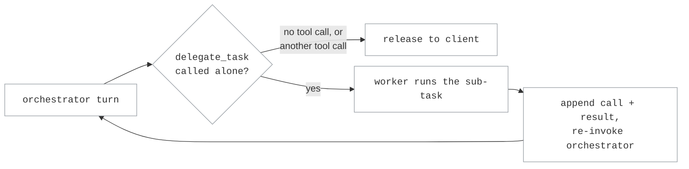

# Delegate Routing

Delegate routing pairs an **orchestrator** (the model under the client's
control, serving every client-visible turn) with a cheaper **worker** it can
call through a synthetic tool. The orchestrator keeps its own tools (read,
write, bash, git, MCP, ...); it is additionally offered one more tool --
`delegate_task` by default -- for handing off small, narrowly-scoped,
mechanical sub-tasks: repository searches, information extraction, test or log
analysis, boilerplate generation, or a simple, well-specified code change. When
the orchestrator calls it, the worker runs the sub-task and its answer is fed
back to the orchestrator as a tool result, so the orchestrator reviews it and
continues -- delegate again, call one of its own tools, or answer directly.
None of this is visible to the client: from its point of view the orchestrator
either answered, or made one of its usual tool calls, exactly as it would with
`passthrough`.

This differs from the classifier and router strategies: those decide *which
model serves a turn*, while delegate routing keeps one model serving and lets
it choose, per sub-task, whether to spend its own inference or hand narrow work
to a worker.

## How it works

Every request routes to the orchestrator with `delegate_task` added to its
tool list. Because a delegated tool call must be resolved before the client
sees anything, every orchestrator call in the loop is buffered (never streamed
to the client directly) so it can be inspected:

- **No tool call, or a tool call other than `delegate_task`** -- the turn is
  released to the client unchanged. A non-`delegate_task` tool call belongs to
  the client's own harness to execute and continue next turn, exactly as with
  `passthrough`.
- **`delegate_task`, alone** -- the orchestrator's turn (including the tool
  call) is appended to the conversation, the task is run on the worker, and
  the worker's answer is appended as that call's tool result. The orchestrator
  is invoked again with the extended conversation, and the loop repeats.
- **`delegate_task` mixed with another tool call** -- rejected. The
  orchestrator must call the delegation tool alone; resolving one and handing
  the other to the client from the same turn is not supported.



A turn that never stops delegating is bounded by `max_delegations`: the
orchestrator round trip that would exceed it fails the request instead of
looping forever. Multiple `delegate_task` calls in the same turn (parallel
delegation) run concurrently against the worker.

The worker sees only the delegated task, not the orchestrator's tool list or
prior conversation: its request is built from the tool call's `task` and
`context` arguments (and `expected_output`, when given), optionally under
`worker_system_prompt`. It cannot ask follow-up questions, so the orchestrator
is expected to supply everything the worker needs up front -- state this in a
system prompt on the orchestrator's own target, or in `tool_description`, if
the packaged description does not fit your harness.

## Configuration

```toml
[targets.orchestrator]
id = "capable/model"
llm_client = "provider"

[targets.worker]
id = "efficient/model"
llm_client = "provider"

[routes.agent]
id = "switchyard/agent"
type = "delegate"
orchestrator_target = "orchestrator"
worker_target = "worker"
max_delegations = 6
```

| Key | Default | Meaning |
|---|---|---|
| `orchestrator_target` | required | Serves every client-visible turn and may delegate sub-tasks. |
| `worker_target` | required | Executes delegated sub-tasks; never a routing destination. |
| `tool_name` | `"delegate_task"` | Name of the synthetic tool exposed to the orchestrator. |
| `tool_description` | built-in | Overrides the description of the delegation tool, including what to (not) delegate. |
| `worker_system_prompt` | unset | System instruction prepended to a delegated sub-task's own request. |
| `max_delegations` | `6` | Orchestrator round trips allowed per client-visible turn, bounding a loop that never converges. |

## Tuning

Keep `tool_description` specific about what belongs on the worker: mechanical,
narrowly-scoped, low-ambiguity work the worker can complete from the supplied
context alone. Reserve architecture decisions, ambiguous requirements,
security-sensitive judgment calls, and anything needing broad reasoning for the
orchestrator itself -- the packaged description states this distinction, and a
custom one should keep it.

`max_delegations` bounds cost, not just runaway loops: each round trip is a
full orchestrator call plus a worker call. Start near the default and raise it
only if legitimate multi-step delegation (research, then use the result to
delegate a second narrow task) is getting cut off.

Because every orchestrator call in the loop is buffered, a request that
delegates adds the worker's latency to the orchestrator's, serially, before the
client sees a token. This trades a slower response for not spending the
orchestrator's own inference (or a client round trip) on work a cheaper model
can do -- benchmark against `passthrough` on the orchestrator alone before
committing to it for latency-sensitive traffic.
